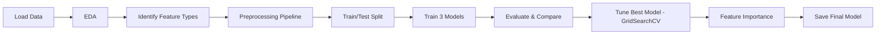

# 📉 Customer Churn Prediction

Predicting which telecom customers are about to leave — before they do — using Logistic Regression, Decision Tree, and Random Forest models built with scikit-learn.

Please view the full code in notebook here - [task_5_customer_churn_prediction.ipynb](https://github.com/yanheinaung23-eng/Codveda-Data-Analysis-Internship-Projects/blob/9881435ec268b6163e0bcb62139ce7a3bd7d7c76/03_level_task_project/task_5_customer_churn_prediction.ipynb)


---

## Table of Contents

- [Business Problem](#business-problem)
- [Dataset](#dataset)
- [Tech Stack](#tech-stack)
- [Project Workflow](#project-workflow)
  - [1. Import Libraries & Load the Dataset](#1-import-libraries--load-the-dataset)
  - [2. Exploratory Data Analysis](#2-exploratory-data-analysis)
  - [3. Identify Feature Types](#3-identify-feature-types)
  - [4. Build a Reusable Preprocessing Pipeline](#4-build-a-reusable-preprocessing-pipeline)
  - [5. Train/Test Split](#5-traintest-split)
  - [6. A Shared Model Evaluation Function](#6-a-shared-model-evaluation-function)
  - [7. Baseline Model — Logistic Regression](#7-baseline-model--logistic-regression)
  - [8. Decision Tree Classifier](#8-decision-tree-classifier)
  - [9. Random Forest Classifier](#9-random-forest-classifier)
  - [10. Hyperparameter Tuning with GridSearchCV](#10-hyperparameter-tuning-with-gridsearchcv)
  - [11. Feature Importance](#11-feature-importance)
  - [12. Visualizing Model Performance](#12-visualizing-model-performance)
  - [13. Comparing All Models](#13-comparing-all-models)
  - [14. Saving the Final Model](#14-saving-the-final-model)
- [Results Summary](#results-summary)
- [Business Insights](#business-insights)
- [Author](#author)

---

## Business Problem

Acquiring a new customer costs far more than keeping an existing one, so being able to flag *which* customers are likely to churn — and *why* — lets a business intervene early (retention offers, targeted support, pricing fixes) instead of reacting after the customer is already gone.

This project builds and compares three classification models to predict customer churn for a telecom provider, then digs into *which factors actually drive churn* so the output is useful to a business team, not just a notebook metric.

## Dataset

The [dataset](https://github.com/yanheinaung23-eng/Codveda-Data-Analysis-Internship-Projects/blob/4d7bf50bda19058f534496970b35947abd6ae56d/03_level_task_project/dataset/churn-bigml-80.csv) (`churn-bigml-80.csv`) — 2,666 customer records with 20 columns, including:

| Category | Columns |
|---|---|
| Account info | `State`, `Account length`, `Area code` |
| Plans | `International plan`, `Voice mail plan`, `Number vmail messages` |
| Usage & billing | `Total day/eve/night/intl minutes`, `calls`, `charge` |
| Support interaction | `Customer service calls` |
| **Target** | `Churn` (boolean — did the customer leave?) |

The dataset is clean going in (no missing values, no duplicates), which is confirmed rather than assumed in the EDA step below.

## Tech Stack

- **Python** — pandas, numpy
- **scikit-learn** — `Pipeline`, `ColumnTransformer`, `GridSearchCV`, `LogisticRegression`, `DecisionTreeClassifier`, `RandomForestClassifier`
- **matplotlib** — feature importance, confusion matrix, ROC curve
- **joblib** — model serialization

```
pandas
numpy
matplotlib
scikit-learn
joblib
```

---

## Project Workflow



Each step below explains **why** it exists in the pipeline, not just what it does.

### 1. Import Libraries & Load the Dataset

Imports are grouped by purpose (data handling → preprocessing → metrics → models) so the notebook reads top-to-bottom as a map of the whole workflow. The load step raises a clear, explicit error if the CSV is missing instead of failing later with a cryptic `NameError` — a small habit that makes the notebook easier for someone else (or future-me) to run.

```python
import pandas as pd
import numpy as np
import matplotlib.pyplot as plt
from pathlib import Path

from sklearn.model_selection import train_test_split, GridSearchCV
from sklearn.compose import ColumnTransformer
from sklearn.pipeline import Pipeline
from sklearn.preprocessing import OneHotEncoder, StandardScaler
from sklearn.impute import SimpleImputer
from sklearn.metrics import (
    accuracy_score, precision_score, recall_score, f1_score,
    roc_auc_score, roc_curve, RocCurveDisplay,
    classification_report, confusion_matrix
)
from sklearn.linear_model import LogisticRegression
from sklearn.tree import DecisionTreeClassifier
from sklearn.ensemble import RandomForestClassifier

# Loading dataset
DATA_PATH = Path("datasets/churn-bigml-80.csv")

if not DATA_PATH.exists():
    raise FileNotFoundError(
        f"Dataset not found at {DATA_PATH.resolve()}. "
        "Make sure churn-bigml-80.csv is in the datasets folder, "
        "in the same directory as this notebook."
    )

df = pd.read_csv(DATA_PATH)
df.head()
```

### 2. Exploratory Data Analysis

Before touching a single model, the data quality gets checked: row/column types (`.info()`), missing values (`.isna().sum()`), and duplicate rows (`.duplicated().sum()`).

```python
df.sample(10)
df.info()

# Detecting null values
df.isna().sum()

# Checking duplicates
df.duplicated().sum()
```

### 3. Identify Feature Types

Numerical and categorical columns need fundamentally different preprocessing — scale numbers, encode categories. Splitting them explicitly here (and separating `X`/`y` first) is what makes the `ColumnTransformer` in the next step possible.

```python
# Separate features and target first
X = df.drop("Churn", axis=1)
y = df["Churn"]

# Categorical vs numeric
categorical_features = X.select_dtypes(include=["object"]).columns
numerical_features = X.select_dtypes(exclude=["object"]).columns

```

### 4. Build a Reusable Preprocessing Pipeline

Rather than manually scaling and encoding columns by hand (easy to get wrong, easy to apply inconsistently between train and test), the preprocessing is wrapped in a `Pipeline` + `ColumnTransformer`.

- Applied `mean` imputation for numeric columns and `most_frequent` imputation for categorical columns.

```python
# Numerical pipeline
numeric_transformer = Pipeline([
    ("imputer", SimpleImputer(strategy="mean")),
    ("scaler", StandardScaler())
])

# Categorical pipeline
categorical_transformer = Pipeline([
    ("imputer", SimpleImputer(strategy="most_frequent")),
    ("encoder", OneHotEncoder(handle_unknown="ignore"))
])

# Combine
preprocessor = ColumnTransformer([
    ("num", numeric_transformer, numerical_features),
    ("cat", categorical_transformer, categorical_features)
])
```

### 5. Train/Test Split

An 80/20 split with `stratify=y` keeps the churn/no-churn ratio consistent across both sets. This matters because churn is imbalanced (~14% of customers churn) — without stratification, a random split could accidentally under- or over-represent churners in the test set and make the evaluation misleading. `random_state=42` keeps the split reproducible.

```python
X_train, X_test, y_train, y_test = train_test_split(
    X, y, test_size=0.2, random_state=42, stratify=y
)
```

### 6. A Shared Model Evaluation Function

All three models get judged the same way, so the evaluation logic is written once and reused instead of copy-pasted three times — one function to fix if the metrics need to change later.

```python
def evaluate_model(name, y_true, y_pred):
    print("=" * 50)
    print(name)
    print("=" * 50)
    print("Accuracy :", accuracy_score(y_true, y_pred))
    print("Precision:", precision_score(y_true, y_pred))
    print("Recall   :", recall_score(y_true, y_pred))
    print("F1 Score :", f1_score(y_true, y_pred))
    print()
    print(classification_report(y_true, y_pred))
```

### 7. Baseline Model — Logistic Regression

Logistic Regression goes first because it's simple, fast, and interpretable — a sanity-check baseline that any more complex model needs to beat to justify its extra complexity.

```python
log_model = Pipeline([
    ("preprocessor", preprocessor),
    ("classifier", LogisticRegression(max_iter=1000))
])

log_model.fit(X_train, y_train)
log_pred = log_model.predict(X_test)
```


**Result:** 84.3% accuracy, but only **21.8% recall** — it catches barely 1 in 5 actual churners. For a churn model, that's the metric that matters most, and it's the first sign a linear model isn't capturing what's really going on.

---

### 8. Decision Tree Classifier

A Decision Tree can capture non-linear relationships and feature interactions that a linear model can't (e.g. "high day usage *and* many service calls" being riskier than either alone).

```python
tree_model = Pipeline([
    ("preprocessor", preprocessor),
    ("classifier", DecisionTreeClassifier(random_state=42))
])

tree_model.fit(X_train, y_train)
tree_pred = tree_model.predict(X_test)
```


**Result:** Recall jumps to **68.0%**, confirming the churn signal is non-linear — a big argument in favor of tree-based models for this dataset.

---

### 9. Random Forest Classifier

Random Forest is an ensemble of many decision trees, which usually reduces the overfitting a single tree is prone to and improves generalization.

```python
rf_model = Pipeline([
    ("preprocessor", preprocessor),
    ("classifier", RandomForestClassifier(random_state=42))
])

rf_model.fit(X_train, y_train)
rf_pred = rf_model.predict(X_test)
```


**Result:** Best accuracy and ROC AUC so far (93.3% / 88.3%), but recall actually *drops* to 55.1% — the default Random Forest is playing it safe and missing more churners than the Decision Tree did. This is the trade-off tuning targets next.

### 10. Hyperparameter Tuning with GridSearchCV

The default Random Forest is precision-heavy at the cost of recall — great precision (97.7%) but it's missing nearly half the customers who actually churn. In a churn use case, missing a real churner is usually more expensive than a false alarm (a wasted retention call is cheap; a lost customer isn't). So the grid search is scored on **F1**, not accuracy, to force a better precision/recall balance, and `class_weight` is included in the search so the model can be told to pay more attention to the minority (churn) class.

```python
param_grid = {
    "classifier__n_estimators": [100, 200, 300],
    "classifier__max_depth": [5, 10, 20, None],
    "classifier__min_samples_split": [2, 5, 10],
    "classifier__min_samples_leaf": [1, 2, 4],
    "classifier__class_weight": [None, "balanced"]
}

grid_search = GridSearchCV(
    rf_model, param_grid, scoring="f1", cv=5, n_jobs=-1
)

grid_search.fit(X_train, y_train)
best_rf_model = grid_search.best_estimator_
best_rf_pred = best_rf_model.predict(X_test)
```

**Best parameters:** `class_weight='balanced'`, `max_depth=10`, `min_samples_leaf=2`, `min_samples_split=10`, `n_estimators=300` (mean CV F1: **0.811**)


**Result:** Recall climbs to **73.1%** while accuracy holds steady at 93.3% — the tuned model catches noticeably more real churners without meaningfully sacrificing overall performance. This is the model that gets saved.

### 11. Feature Importance

A tuned model that performs well is useful; a tuned model that also explains *why* it makes its predictions is what actually gets used by a business team. Pulling feature importances out of the trained Random Forest turns the model from a black box into a set of actionable signals.

```python
feature_names = best_rf_model.named_steps["preprocessor"].get_feature_names_out()
rf = best_rf_model.named_steps["classifier"]

feature_importance = pd.DataFrame({
    "Feature": feature_names,
    "Importance": rf.feature_importances_
}).sort_values(by="Importance", ascending=False)

print(feature_importance.head(10))
```

| Rank | Feature | Importance |
|---|---|---|
| 1 | Customer service calls | 0.1535 |
| 2 | Total day minutes | 0.1348 |
| 3 | Total day charge | 0.1337 |
| 4 | International plan — No | 0.0660 |
| 5 | International plan — Yes | 0.0649 |
| 6 | Total eve charge | 0.0412 |
| 7 | Total eve minutes | 0.0402 |
| 8 | Total intl charge | 0.0382 |
| 9 | Total intl minutes | 0.0330 |
| 10 | Total intl calls | 0.0324 |

### 12. Visualizing Model Performance

Numbers in a table are easy to skim past; a chart isn't. Three visuals cover three different questions: **what** drives churn (feature importance), **where** the model gets it wrong (confusion matrix), and **how well** it separates the two classes across every possible threshold (ROC curve).

```python
plt.figure(figsize=(10, 6))
plt.barh(feature_importance["Feature"][:10], feature_importance["Importance"][:10])
plt.gca().invert_yaxis()
plt.xlabel("Importance")
plt.title("Top 10 Feature Importance")
plt.tight_layout()
plt.show()
```


```python
from sklearn.metrics import ConfusionMatrixDisplay

ConfusionMatrixDisplay.from_estimator(
    best_rf_model, X_test, y_test, cmap="Blues"
)
plt.title("Confusion Matrix (Tuned Random Forest)")
plt.xlabel("What model predicted")
plt.ylabel("What actually happened")
plt.show()
```


```python
RocCurveDisplay.from_estimator(best_rf_model, X_test, y_test)
plt.title("ROC Curve - Random Forest")
plt.grid(alpha=0.3)
plt.show()
```


---

### 13. Comparing All Models

The whole point of building three models with an identical preprocessing pipeline is to compare them fairly, side by side, on the same metrics — the table makes the case for the final model choice instead of just asserting it.

```python
result_table = pd.DataFrame({
    "Metric": ["Accuracy", "Precision", "Recall", "F1 Score", "ROC AUC"],
    "Logistic Regression": [log_accuracy, log_precision, log_recall, log_f1, log_roc_auc],
    "Decision Tree": [tree_accuracy, tree_precision, tree_recall, tree_f1, tree_roc_auc],
    "Random Forest": [rf_accuracy, rf_precision, rf_recall, rf_f1, rf_roc_auc]
})
result_table
```

### 14. Saving the Final Model

`joblib.dump` serializes the *entire fitted pipeline* — preprocessing and all — not just the classifier. That means the saved file can take raw, unprocessed customer data and go straight to a prediction, with no separate preprocessing code to keep in sync at inference time.

```python
import joblib

joblib.dump(best_rf_model, "customer_churn_prediction_random_forest_model.pkl")
```

---

## Results Summary

| Metric | Logistic Regression | Decision Tree | Random Forest (default) | **Tuned Random Forest** |
|---|---|---|---|---|
| Accuracy | 84.27% | 90.64% | 93.26% | **93.26%** |
| Precision | 42.50% | 67.95% | 97.73% | **79.17%** |
| Recall | 21.79% | 67.95% | 55.13% | **73.08%** |
| F1 Score | 28.81% | 67.95% | 70.49% | **76.00%** |
| ROC AUC | 74.35% | 81.23% | 88.26% | **87.76%** |

**Tuned Random Forest** is the final model — it keeps the accuracy and ROC AUC of the default Random Forest while catching significantly more actual churners (73% recall vs. 55%), which is the metric that matters most for a retention use case.

---

## Business Insights

- **Customer service calls is the single strongest churn signal.** Customers who call support often are at meaningfully higher risk of leaving — a natural trigger for proactive outreach rather than waiting for a cancellation request.
  
- **Day-time usage and charges matter a lot.** High day-minute, high day-charge customers churn more, which points toward price sensitivity during peak-usage hours as a lever worth investigating (e.g. loyalty pricing or usage-based offers).
  
- **Having an international plan is a meaningful predictor** (the "Yes"/"No" split together rank among the top 5 features), suggesting the plan's pricing or value proposition may not be landing the way it should for a chunk of subscribers.

---

## Author

Built by **Yan** — Data Analyst / BI professional transitioning into data from a maritime background, with Google Data Analytics, Business Intelligence, and AI certifications.

- GitHub: [add your GitHub profile link]
- LinkedIn: [add your LinkedIn profile link]
